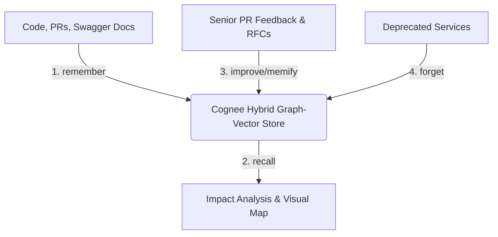

# 🔎 ArchLens

> **The Continuous Architecture & Codebase Evolution Agent.** 
> Built for the WeMakeDevs x Cognee Hackathon 2026. Powered by Cognee's hybrid graph-vector memory layer.

Traditional RAG tools fail when analyzing complex software systems because code isn't just flat text—it is a deeply interconnected web of dependencies, structural relationships, and historical context. **ArchLens** uses Cognee to bridge this gap, giving AI agents a permanent, self-correcting structural memory of your entire software ecosystem. 

ArchLens ingests repositories, PR histories, architectural RFCs, and API schemas, turning abstract codebases into an interactive, navigable, and deeply searchable **Knowledge Graph**.

---

## 🚀 Key Features

*   **Interactive Architecture Mapping:** Visually explore the actual memory nodes and edges constructed by Cognee inside a modern Next.js dashboard.
*   **Cross-Session Impact Analysis:** Ask deep structural questions (e.g., *"If I migrate our auth gateway to Go, what downstream TypeScript services break?"*) across infinite developer sessions.
*   **The Silent Reviewer:** Automatically runs during pull requests to catch structural drift against older architectural RFCs and guidelines.

---

## 🧠 How We Use Cognee

ArchLens relies entirely on Cognee’s core memory lifecycle to ensure developer context is never lost, bloated, or stale:


### 1. remember() — Multi-Modal Code Ingestion
ArchLens listens to GitHub repository webhooks and triggers data ingestion. It parses and stores files, openAPI schemas, and markdown documentation:
```python
await cognee.remember(file="user_service_api.yaml")
await cognee.remember("UserService depends_on PostgresDB and triggers Events via RabbitMQ.")

```
### 2. recall() — Deep Graph-Vector Traversal
When a developer queries the system about system dependencies, Cognee routes the search between semantic meaning and deep graph relationships to trace precise code paths:
```python
# Traces entire dependency trees across historically separated repository context
impact_report = await cognee.recall("What services consume the /v1/auth endpoint?")

```
### 3. improve() / memify — Learning From Code Reviews
When a developer updates architectural guidelines or approves a PR with crucial context, ArchLens runs improve() to update graph weights and relationship nodes based on the latest consensus:
```python
await cognee.remember("CRITICAL: Do not use direct DB connections in the Notification module.")
await cognee.improve() # Re-weights the memory graph to prioritize this rule

```
### 4. forget() — Pruning Technical Debt
When microservices are deprecated or feature branches are deleted, ArchLens surgically removes old nodes to prevent the AI from generating obsolete recommendations:
```python
await cognee.forget(dataset="deprecated_v1_billing_legacy")

```
## 🛠️ Tech Stack
 * **Frontend:** Next.js, TypeScript, Tailwind CSS, React Flow (for graph visualization).
 * **Backend:** Node.js pool for repository parsing and webhook handling.
 * **AI Memory Layer:** Cognee (Self-hosted Docker Engine / Cloud Developer Plan).
 * **Deployment:** Docker, Vercel.
## 🏃‍♂️ Getting Started
### Prerequisites
 * Docker & Docker Compose
 * Node.js v18+
 * Cognee API Token or Local Instance
### Installation
 1. **Clone the repository:**
   ```bash
   git clone [https://github.com/your-username/archlens.git](https://github.com/your-username/archlens.git)
   cd archlens
   
   ```
 2. **Configure environment variables:**
   Create a .env file in the root directory:
   ```env
   COGNEE_API_KEY=your_cognee_key_here
   GITHUB_WEBHOOK_SECRET=your_secret
   
   ```
 3. **Install dependencies and spin up the development environment:**
   ```bash
   npm install
   npm run dev
   
   ```
